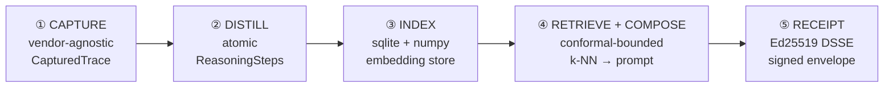

<div align="center">

# 🧠 ANAMNESIS

### Verifiable reasoning-trace memory for LLM agents

*Capture thinking-tokens → distill to atomic steps → reuse via conformal-bounded retrieval → emit an Ed25519-signed receipt for every decision.*

[](#-license)
[](#-status)
[](#-quickstart)
[](#cross-language-verification)
[](#-receipts)
[](#-eu-ai-act-mapping)

[Why](#-why) · [How it works](#-how-it-works) · [Quickstart](#-quickstart) · [SDK](#-python-sdk) · [Server](#-http-server) · [CLI](#-cli) · [Receipts](#-receipts) · [Compliance](#-eu-ai-act-mapping) · [Status](#-status)

</div>

---

## 💡 Why

Reasoning models burn the majority of their cost on **thinking-tokens** — the internal
chain-of-thought you pay for but never reuse. The same organisation asks semantically
near-identical questions every day and re-derives the same reasoning from scratch each time.

ANAMNESIS is a memory layer that **captures that reasoning once, proves when it is safe to
reuse, and leaves a cryptographic paper-trail** for auditors:

- **💰 Cut thinking-token spend** — reuse prior reasoning for near-duplicate queries instead of re-deriving it.
- **📐 Reuse with a guarantee, not a vibe** — a split-conformal bound caps the worst-case semantic drift you accept (`tau`) at a chosen miscoverage level (`alpha`); below the bound you reuse, above it you abstain.
- **🧾 Provable audit trail** — every reuse emits an Ed25519-signed DSSE receipt that any third party can verify offline, in Python *or* TypeScript, without contacting the server.
- **🔌 Vendor-neutral** — one SDK and one receipt format across five reasoning providers.

---

## 🏗 How it works

A five-stage pipeline. Each stage is a small, independently-testable module; nothing calls
an LLM unless you wire one in.



| Stage | Module | What it does |
|-------|--------|--------------|
| **① Capture** | `anamnesis.capture` | Normalises each vendor's response shape into a `CapturedTrace` (thinking text, answer, token counts, signature). |
| **② Distill** | `anamnesis.distill` | Splits a trace into atomic `ReasoningStep`s — heuristic (offline) or LLM-backed. |
| **③ Index** | `anamnesis.storage` | Persists steps in sqlite and an in-process numpy vector index (rebuilt from disk on restart). |
| **④ Retrieve + Compose** | `anamnesis.retrieve` / `anamnesis.compose` | k-NN lookup, filtered by the conformal threshold, spliced into a deterministic prompt fragment. |
| **⑤ Receipt** | `anamnesis.receipts` | Wraps the decision (capture hash, retrieved step ids, bound, tokens saved) in a signed DSSE envelope. |

### Supported building blocks

| Capability | Options |
|------------|---------|
| **Capture providers** | Anthropic (Extended Thinking) · OpenAI (o1/o3) · DeepSeek R1 · Google Gemini · Mistral / Magistral |
| **Distillers** | `HeuristicDistiller` (offline) · `LLMDistiller` (any callable) · `AnthropicHaikuDistiller` (production, with heuristic fallback) |
| **Embedders** | `hash_embedder` (deterministic, no network) · `fastembed_embedder` (ONNX, no API keys) |
| **Calibrators** | `ConformalCalibrator` (marginal) · `MondrianCalibrator` (per-group) · `ConditionalConformalCalibrator` (per-bucket) |

---

## ⚡ Quickstart

```bash
# install everything (SDK + server + dev tooling)
uv sync --all-packages --all-extras

# run the whole test suite (384 Python + 22 TypeScript = 406)
uv run pytest -q anamnesis-py anamnesis-server agents

# see the full pipeline end-to-end on synthetic data (no API keys needed)
uv run python -m anamnesis.cli demo

# or run the worked examples
uv run python examples/02_reuse_demo.py
uv run python examples/04_savings_demo.py

# boot the HTTP server
uv run uvicorn anamnesis_server.main:app --reload
```

---

## 🐍 Python SDK

Capture → distill → index → retrieve → compose → sign → verify, all offline:

```python
from anamnesis import (
    CapturedTrace, HeuristicDistiller, TraceStore, hash_embedder,
    ConformalCalibrator, ModelRef, Receipt, BoundRef,
    ReceiptSigner, ReceiptVerifier,
)
from anamnesis.retrieve import ConformalRetriever
from anamnesis.compose import compose

store = TraceStore(embedder=hash_embedder(dim=128))
distiller = HeuristicDistiller(min_step_chars=20)

# 1) capture + distill + index a reasoning trace
trace = CapturedTrace(
    provider="anthropic", model="claude-opus-4-7", request_id="req-1",
    thinking_text="Area of a triangle = ½·base·height. With b=10, h=6 → 30.",
    answer_text="30", thinking_tokens=24, output_tokens=2,
)
store.add_trace(trace)
store.add_steps(distiller.distill(trace))

# 2) warm a conformal calibrator, then retrieve under the bound
cal = ConformalCalibrator(alpha=0.1, min_calibration=30)
cal.extend([0.4, 0.5, 0.6, 0.7] * 10)
retriever = ConformalRetriever(store=store, calibrator=cal, k=5)
result = retriever.retrieve("How do I find a triangle's area from base and height?")

# 3) compose a reuse prompt fragment (empty if it abstained)
composed = compose(result, user_text="...")

# 4) sign a receipt for the decision, then verify it offline
signer = ReceiptSigner.generate("issuer-key")
receipt = Receipt(
    tenant_id="acme", request_id="req-1",
    model=ModelRef(provider="anthropic", name="claude-opus-4-7"),
    capture_hash=trace.content_hash, distill_model=distiller.name,
    retrieved_step_ids=list(composed.reused_step_ids),
    bound=BoundRef(tau=result.bound.tau, alpha=result.bound.alpha,
                   n_calibration=result.bound.n_calibration),
    cost_saved_tokens=42,
)
envelope = signer.sign(receipt)
verifier = ReceiptVerifier.from_public_key_b64("issuer-key", signer.public_key_b64())
verifier.verify(envelope)   # raises BadSignatureError on tampering
```

---

## 🌐 HTTP Server

A multi-tenant FastAPI backend. Storage and calibration are per-tenant; receipts are signed
with an issuer key recovered from `ANAMNESIS_SIGNING_SEED_B64` (or generated per process).

| Method | Path | Purpose |
|--------|------|---------|
| `POST` | `/v1/captures` | Persist a captured trace and distil it into steps |
| `POST` | `/v1/reuse` | Conformal retrieval → composed prompt → signed receipt |
| `POST` | `/v1/calibration` | Record a fresh-vs-retrieved non-conformity score |
| `GET`  | `/v1/calibration/{tenant}` | Read a tenant's calibrator status |
| `GET`  | `/v1/compliance/eu_ai_act` | Static Article 15 / 50 evidence matrix |
| `GET`  | `/health` | Liveness probe |

```bash
curl -s localhost:8000/v1/captures -H 'content-type: application/json' -d '{
  "tenant_id": "acme",
  "request_id": "req-1",
  "model": {"provider": "anthropic", "name": "claude-opus-4-7"},
  "thinking_text": "Area of a triangle = one half base times height ...",
  "answer_text": "30", "thinking_tokens": 120, "output_tokens": 5
}'
```

Configuration via environment:

| Variable | Effect |
|----------|--------|
| `ANAMNESIS_DB_ROOT` | Persist each tenant to `<root>/<tenant-prefix>-<digest>.db` instead of in-memory |
| `ANAMNESIS_SIGNING_SEED_B64` | Recover a stable issuer keypair across restarts |
| `ANAMNESIS_SIGNING_KEYID` | Key id stamped into each signature (default `anamnesis-server-default`) |

---

## 🖥 CLI

```bash
anamnesis status                              # SDK + optional-extra availability
anamnesis keygen --out issuer.json            # fresh Ed25519 issuer keypair
anamnesis verify --pubkey-b64 <KEY> receipt.json
anamnesis distill -i thinking.txt             # thinking text → reasoning steps (JSON)
anamnesis demo                                # full pipeline on synthetic data
```

### 💵 Savings calculator

Estimate the token-savings on a prospect's **own** workload — no LLM calls, runs entirely
offline. Accepts JSONL **or** CSV of `(query, thinking_tokens, output_tokens)` rows:

```bash
anamnesis savings -i workload.csv -p deepseek-r1 --reuse-threshold 0.15
```

`--reuse-threshold` (tau) is the accepted worst-case semantic drift: a query counts as
reusable when its nearest prior neighbour is within it. Output is a measured ROI number
(reuse rate, thinking-tokens saved, dollar value at the provider's rates) — not a marketing claim.

---

## 🧾 Receipts

Receipts follow the [DSSE](https://github.com/secure-systems-lab/dsse) envelope format with
Pre-Authentication Encoding, so the signature binds the exact payload bytes and resists
JSON-canonicalisation attacks.

```jsonc
{
  "payloadType": "application/vnd.anamnesis.receipt+json",
  "payload": "<base64 of the canonical receipt JSON>",
  "signatures": [{ "keyid": "issuer-key", "sig": "<base64 Ed25519 signature>" }]
}
```

The decoded payload records the full lineage of one reuse decision:

```jsonc
{
  "schema_version": "anamnesis/v1",
  "receipt_id": "…", "issued_at": "2026-06-09T…Z",
  "tenant_id": "acme", "request_id": "req-1",
  "model": { "provider": "anthropic", "name": "claude-opus-4-7", "version": null },
  "capture_hash": "sha256:…",
  "distill_model": "heuristic-v1",
  "retrieved_step_ids": ["step_…"],
  "bound": { "tau": 0.18, "alpha": 0.1, "n_calibration": 64, "score_name": "one_minus_cosine" },
  "cost_saved_tokens": 42,
  "eu_ai_act_claims": { "article_15": true, "article_50": true }
}
```

### Cross-language verification

An auditor can verify a server-issued receipt with the TypeScript SDK
([`@anamnesis/sdk`](anamnesis-ts/)) — zero dependency beyond audited `@noble/ed25519`, runs in
the browser:

```ts
import { verifyEnvelope } from "@anamnesis/sdk";

const receipt = await verifyEnvelope(envelope, [{ keyid, publicKeyB64 }]);
// throws ReceiptVerificationError on any tampering
```

Python↔TypeScript round-trips are verified in both directions, including non-ASCII payloads
(see `benchmarks/cross_lang_receipts.py`).

---

## 📜 EU AI Act mapping

Every signed receipt carries the evidence fields a notified body needs to verify each clause
**mechanically**. This is the same data the server serves at `/v1/compliance/eu_ai_act`.

| Article | Clause | Evidence fields in the receipt |
|---------|--------|--------------------------------|
| **15** — Accuracy, robustness, cybersecurity | 15(1), 15(4) | `bound.tau`, `bound.alpha`, `bound.n_calibration` |
| | 15(2) | `bound.score_name`, `bound.alpha` |
| | 15(3) | `schema_version`, `issued_at` |
| **50** — Transparency | 50(2) | `capture_hash`, `model.provider`, `model.name` |
| | 50(4) | `receipt_id`, `issued_at`, `tenant_id` |

---

## 📂 Repository layout

```
anamnesis-py/        Python SDK — capture, distill, storage, conformal, retrieve, compose, receipts, keystore, CLI
anamnesis-server/    FastAPI backend — multi-tenant storage, calibration, signed-receipt issuance
anamnesis-ts/        TypeScript SDK — offline DSSE verify + sign (@noble/ed25519)
anamnesis-web/       Astro dashboard — receipt verifier + EU-AI-Act mapping UI
agents/              Honesty-auditor + claim-signing tooling (VCOS)
benchmarks/          Throughput, multi-tenant load, persistence, cross-language interop
examples/            Worked end-to-end scripts (capture → reuse → receipt → savings)
docs/                Architecture, EU-AI-Act mapping, conformal-prediction theory
```

---

## ✅ Status

**Pre-alpha — not yet hardened for production.** APIs may change. **406 tests passing**
(384 Python across SDK + server + tooling, 22 TypeScript). The conformal guarantees,
DSSE signing/verification, and cross-language interop are exercised by the suite and the
benchmarks; storage durability across restarts is verified end-to-end.

---

## 📦 Requirements

- Python **3.11+**, [`uv`](https://github.com/astral-sh/uv) for workspace management
- Node **18+** (only for the TypeScript SDK / web dashboard)
- Optional extras: `fastembed` (real embeddings), `anthropic` / `openai` (live capture & distillation)

---

## 📄 License

Apache License 2.0 — see [LICENSE](LICENSE).

Re-licensed from All-Rights-Reserved on 2026-05-22 as part of the TRUST-OS unified-license
architecture. Copyright © 2026 Ozan Küsmez.

---

## 📬 Contact

Questions, collaboration, or inquiries: **Ozan Küsmez** — <ozan.kuesmez@outlook.com>
