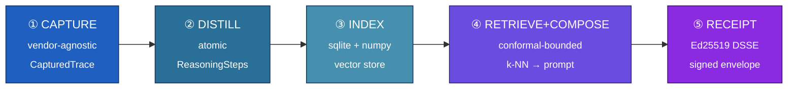

<div align="center">

# 🧠 ANAMNESIS

### Your reasoning model thinks once. ANAMNESIS makes it count — *and proves it.*

Capture thinking-tokens · distill them to atomic steps · reuse them under a **conformal guarantee** · sign every decision with an **Ed25519 receipt** any auditor can verify offline.

[](#-license)
[](#-status)
[](#-60-second-tour)
[](#cross-language-verification)
[](#-eu-ai-act-mapping)

<samp>[Why](#-the-problem) · [Tour](#-60-second-tour) · [How](#-how-it-works) · [SDK](#-python-sdk) · [Server](#-http-server) · [CLI](#-cli) · [Receipts](#-receipts) · [Compliance](#-eu-ai-act-mapping) · [Status](#-status)</samp>

</div>

---

> [!NOTE]
> **In one sentence:** ANAMNESIS is a memory layer for reasoning LLMs that lets an agent
> *reuse* prior chain-of-thought instead of paying to re-derive it — and wraps every reuse in
> a cryptographically signed, independently-verifiable audit receipt.

## 💸 The problem

Reasoning models spend most of your money on **thinking-tokens** — the internal deliberation
you're billed for and then throw away. Your organisation asks the *same shape* of question all
day long and re-derives the *same reasoning* from scratch every single time.

<table>
<tr><th align="left">❌ Without ANAMNESIS</th><th align="left">✅ With ANAMNESIS</th></tr>
<tr valign="top">
<td>

- Every near-duplicate query re-thinks from zero
- Thinking-token spend scales with traffic, not with novelty
- "Did we reuse safely?" → a shrug
- Compliance evidence → a screenshot, maybe

</td>
<td>

- Prior reasoning is retrieved and **reused**
- You pay for **novelty**, not repetition
- Reuse only fires **below a conformal bound** you set
- Every decision ships a **signed receipt** an auditor can verify

</td>
</tr>
</table>

> [!TIP]
> The reuse decision is **not** a vibe. A split-conformal bound caps the worst-case semantic
> drift you accept (`tau`) at a chosen miscoverage level (`alpha`). Below the bound → reuse.
> Above it → abstain and let the model think. The exact bound is recorded in the receipt.

---

## 🚀 60-second tour

```bash
uv sync --all-packages --all-extras          # install SDK + server + tooling
uv run python -m anamnesis.cli demo           # full pipeline on synthetic data, no API keys
```

```text
=== demo ===
  seeded steps:   14
  candidates:     5
  accepted:       3
  abstained:      False
  bound:          tau=0.7000 alpha=0.1 n=40
    [1] score=0.2830 intent='Compute the area of a triangle from base and height.'
```

That's capture → distill → index → conformal retrieval → composed prompt → **signed receipt**,
end to end, offline. Now wire in your own traces. 👇

---

## 🏗 How it works

Five small, independently-testable stages. Nothing calls an LLM unless *you* plug one in.



| Stage | Module | What it does |
|-------|--------|--------------|
| **① Capture** | `anamnesis.capture` | Normalises each vendor's response shape into a `CapturedTrace`. |
| **② Distill** | `anamnesis.distill` | Splits a trace into atomic `ReasoningStep`s — heuristic (offline) or LLM-backed. |
| **③ Index** | `anamnesis.storage` | Persists steps in sqlite + an in-process numpy index (rebuilt from disk on restart). |
| **④ Retrieve + Compose** | `anamnesis.retrieve` · `anamnesis.compose` | k-NN lookup filtered by the conformal threshold, spliced into a deterministic prompt. |
| **⑤ Receipt** | `anamnesis.receipts` | Wraps the decision in an Ed25519-signed DSSE envelope. |

### 🧩 Swappable building blocks

<table>
<tr>
<td><b>🔌 Capture providers</b><br/><sub>Anthropic · OpenAI o1/o3 · DeepSeek R1 · Gemini · Mistral</sub></td>
<td><b>✂️ Distillers</b><br/><sub>Heuristic · any LLM callable · Claude Haiku (with fallback)</sub></td>
</tr>
<tr>
<td><b>🧮 Embedders</b><br/><sub>hash (deterministic, offline) · fastembed (ONNX, no API keys)</sub></td>
<td><b>📐 Calibrators</b><br/><sub>Conformal · Mondrian (per-group) · Conditional (per-bucket)</sub></td>
</tr>
</table>

---

## 🐍 Python SDK

Capture → distill → index → retrieve → compose → sign → verify, fully offline:

```python
from anamnesis import (
    CapturedTrace, HeuristicDistiller, TraceStore, hash_embedder,
    ConformalCalibrator, ModelRef, Receipt, BoundRef,
    ReceiptSigner, ReceiptVerifier,
)
from anamnesis.retrieve import ConformalRetriever
from anamnesis.compose import compose

store = TraceStore(embedder=hash_embedder(dim=128))
distiller = HeuristicDistiller(min_step_chars=20)

# 1) capture + distill + index a reasoning trace
trace = CapturedTrace(
    provider="anthropic", model="claude-opus-4-7", request_id="req-1",
    thinking_text="Area of a triangle = ½·base·height. With b=10, h=6 → 30.",
    answer_text="30", thinking_tokens=24, output_tokens=2,
)
store.add_trace(trace)
store.add_steps(distiller.distill(trace))

# 2) warm a conformal calibrator, then retrieve under the bound
cal = ConformalCalibrator(alpha=0.1, min_calibration=30)
cal.extend([0.4, 0.5, 0.6, 0.7] * 10)
retriever = ConformalRetriever(store=store, calibrator=cal, k=5)
result = retriever.retrieve("How do I find a triangle's area from base and height?")

# 3) compose a reuse prompt fragment (empty if it abstained)
composed = compose(result, user_text="...")

# 4) sign a receipt for the decision, then verify it offline
signer = ReceiptSigner.generate("issuer-key")
receipt = Receipt(
    tenant_id="acme", request_id="req-1",
    model=ModelRef(provider="anthropic", name="claude-opus-4-7"),
    capture_hash=trace.content_hash, distill_model=distiller.name,
    retrieved_step_ids=list(composed.reused_step_ids),
    bound=BoundRef(tau=result.bound.tau, alpha=result.bound.alpha,
                   n_calibration=result.bound.n_calibration),
    cost_saved_tokens=42,
)
envelope = signer.sign(receipt)
verifier = ReceiptVerifier.from_public_key_b64("issuer-key", signer.public_key_b64())
verifier.verify(envelope)   # ✅ returns the Receipt · ❌ raises BadSignatureError on tampering
```

---

## 🌐 HTTP Server

A multi-tenant FastAPI backend — per-tenant storage and calibration, issuer-signed receipts.

| Method | Path | Purpose |
|--------|------|---------|
| `POST` | `/v1/captures` | Persist a captured trace and distil it into steps |
| `POST` | `/v1/reuse` | Conformal retrieval → composed prompt → signed receipt |
| `POST` | `/v1/calibration` | Record a fresh-vs-retrieved non-conformity score |
| `GET`  | `/v1/calibration/{tenant}` | Read a tenant's calibrator status |
| `GET`  | `/v1/compliance/eu_ai_act` | Static Article 15 / 50 evidence matrix |
| `GET`  | `/health` | Liveness probe |

<details>
<summary><b>Run it & fire a request</b> (click to expand)</summary>

```bash
uv run uvicorn anamnesis_server.main:app --reload
```

```bash
curl -s localhost:8000/v1/captures -H 'content-type: application/json' -d '{
  "tenant_id": "acme",
  "request_id": "req-1",
  "model": {"provider": "anthropic", "name": "claude-opus-4-7"},
  "thinking_text": "Area of a triangle = one half base times height ...",
  "answer_text": "30", "thinking_tokens": 120, "output_tokens": 5
}'
```

| Env var | Effect |
|---------|--------|
| `ANAMNESIS_DB_ROOT` | Persist each tenant to `<root>/<prefix>-<digest>.db` instead of in-memory |
| `ANAMNESIS_SIGNING_SEED_B64` | Recover a stable issuer keypair across restarts |
| `ANAMNESIS_SIGNING_KEYID` | Key id stamped into each signature |

</details>

---

## 🖥 CLI

```bash
anamnesis status                          # SDK + optional-extra availability
anamnesis keygen --out issuer.json        # fresh Ed25519 issuer keypair
anamnesis verify --pubkey-b64 <KEY> receipt.json
anamnesis distill -i thinking.txt         # thinking text → reasoning steps (JSON)
anamnesis demo                            # full pipeline on synthetic data
```

> [!IMPORTANT]
> **💵 Savings calculator** — estimate the token-savings on a prospect's *own* workload, no LLM
> calls, fully offline. Takes JSONL **or** CSV of `(query, thinking_tokens, output_tokens)`:
> ```bash
> anamnesis savings -i workload.csv -p deepseek-r1 --reuse-threshold 0.15
> ```
> `--reuse-threshold` (tau) is the accepted worst-case semantic drift; a query is reusable when
> its nearest prior neighbour is within it. The output is a *measured* ROI number — not a pitch.

---

## 🧾 Receipts

Receipts use the [DSSE](https://github.com/secure-systems-lab/dsse) envelope with
Pre-Authentication Encoding, so the signature binds the exact payload bytes and resists
JSON-canonicalisation attacks.

```jsonc
{
  "payloadType": "application/vnd.anamnesis.receipt+json",
  "payload": "<base64 of the canonical receipt JSON>",
  "signatures": [{ "keyid": "issuer-key", "sig": "<base64 Ed25519 signature>" }]
}
```

<details>
<summary><b>Decoded payload — the full lineage of one reuse decision</b></summary>

```jsonc
{
  "schema_version": "anamnesis/v1",
  "receipt_id": "…", "issued_at": "2026-06-09T…Z",
  "tenant_id": "acme", "request_id": "req-1",
  "model": { "provider": "anthropic", "name": "claude-opus-4-7", "version": null },
  "capture_hash": "sha256:…",
  "distill_model": "heuristic-v1",
  "retrieved_step_ids": ["step_…"],
  "bound": { "tau": 0.18, "alpha": 0.1, "n_calibration": 64, "score_name": "one_minus_cosine" },
  "cost_saved_tokens": 42,
  "eu_ai_act_claims": { "article_15": true, "article_50": true }
}
```

</details>

### Cross-language verification

Verify a server-issued receipt with the TypeScript SDK ([`@anamnesis/sdk`](anamnesis-ts/)) —
zero dependency beyond audited `@noble/ed25519`, runs in the browser:

```ts
import { verifyEnvelope } from "@anamnesis/sdk";

const receipt = await verifyEnvelope(envelope, [{ keyid, publicKeyB64 }]);
// ✅ returns the receipt · ❌ throws ReceiptVerificationError on any tampering
```

> [!TIP]
> Python↔TypeScript round-trips are verified **in both directions**, including non-ASCII
> payloads — see [`benchmarks/cross_lang_receipts.py`](benchmarks/cross_lang_receipts.py).

---

## 📜 EU AI Act mapping

Every signed receipt carries the evidence fields a notified body needs to verify each clause
**mechanically** — the same data the server serves at `/v1/compliance/eu_ai_act`.

| Article | Clause | Evidence fields in the receipt |
|---------|--------|--------------------------------|
| **15** — Accuracy, robustness, cybersecurity | 15(1), 15(4) | `bound.tau` · `bound.alpha` · `bound.n_calibration` |
| | 15(2) | `bound.score_name` · `bound.alpha` |
| | 15(3) | `schema_version` · `issued_at` |
| **50** — Transparency | 50(2) | `capture_hash` · `model.provider` · `model.name` |
| | 50(4) | `receipt_id` · `issued_at` · `tenant_id` |

---

## 📂 Repository layout

```
anamnesis-py/        Python SDK — capture · distill · storage · conformal · retrieve · compose · receipts · keystore · CLI
anamnesis-server/    FastAPI backend — multi-tenant storage, calibration, signed-receipt issuance
anamnesis-ts/        TypeScript SDK — offline DSSE verify + sign (@noble/ed25519)
anamnesis-web/       Astro dashboard — receipt verifier + EU-AI-Act mapping UI
agents/              Honesty-auditor + claim-signing tooling (VCOS)
benchmarks/          Throughput · multi-tenant load · persistence · cross-language interop
examples/            Worked end-to-end scripts (capture → reuse → receipt → savings)
docs/                Architecture · EU-AI-Act mapping · conformal-prediction theory
```

---

## ✅ Status

> [!WARNING]
> **Pre-alpha — not yet hardened for production. APIs may change.**

**406 tests passing** (384 Python across SDK + server + tooling, 22 TypeScript). Conformal
guarantees, DSSE signing/verification, and cross-language interop are exercised by the suite and
benchmarks; storage durability across restarts is verified end-to-end.

```bash
uv run pytest -q anamnesis-py anamnesis-server agents     # 384 Python
cd anamnesis-ts && npm test                               # 22 TypeScript
```

**Requirements:** Python 3.11+ · [`uv`](https://github.com/astral-sh/uv) · Node 18+ (TS SDK / web only) · optional extras `fastembed`, `anthropic`, `openai`.

---

## 📄 License

Apache License 2.0 — see [LICENSE](LICENSE). Re-licensed from All-Rights-Reserved on
2026-05-22 as part of the TRUST-OS unified-license architecture. Copyright © 2026 Ozan Küsmez.

## 📬 Contact

Questions, collaboration, or inquiries: **Ozan Küsmez** — <ozan.kuesmez@outlook.com>
